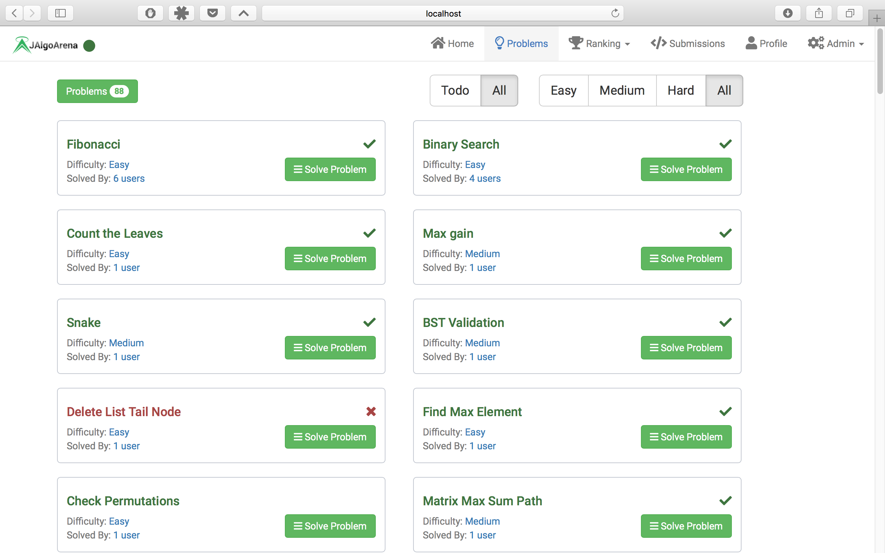
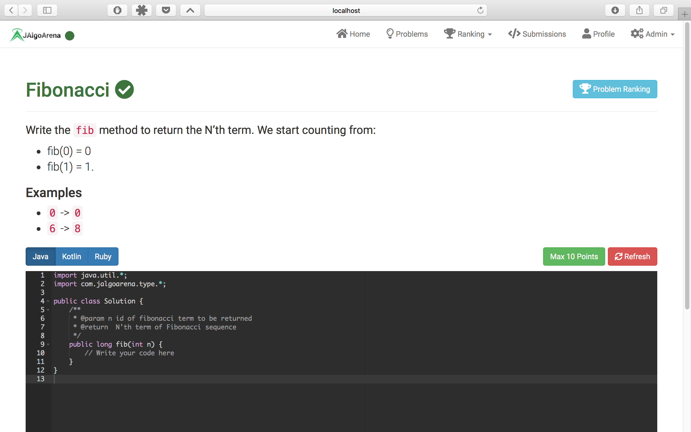
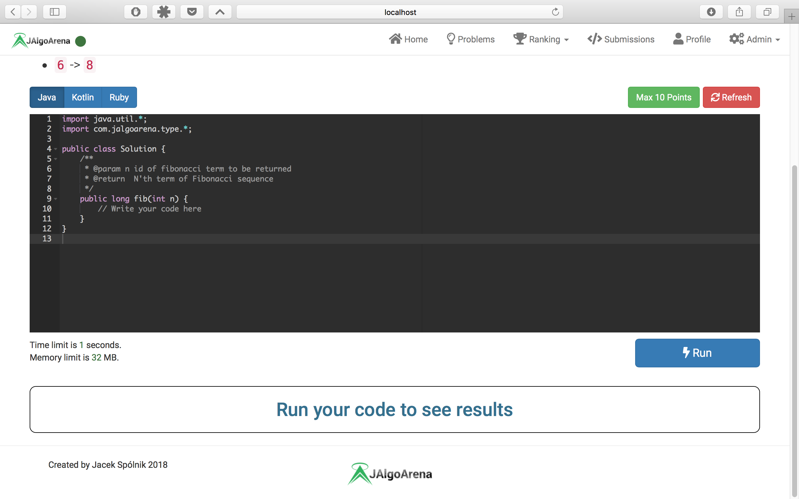
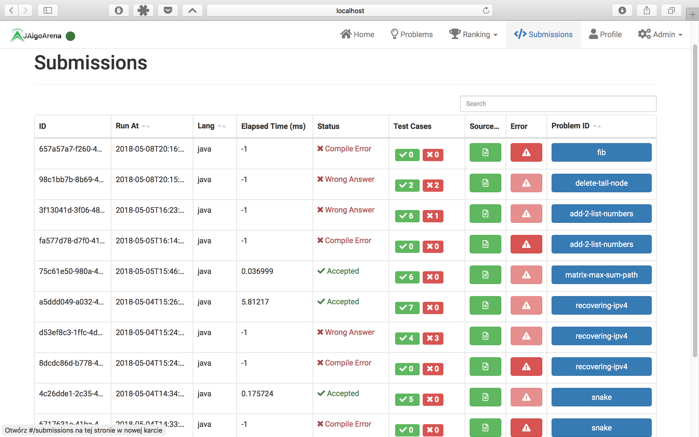
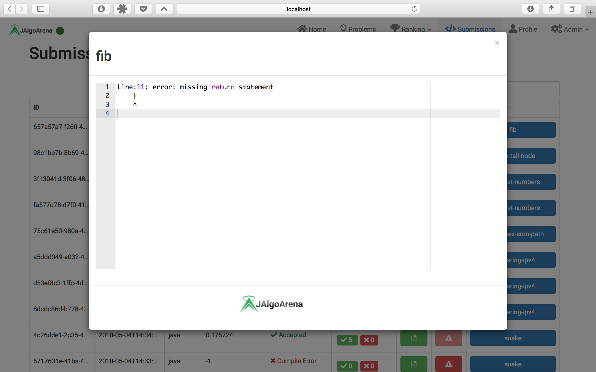
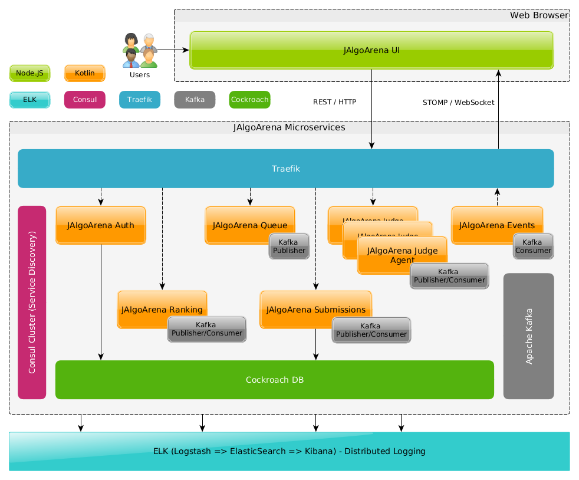

# JAlgoArena  

JAlgoArena is a programming contest platform. You can host it on any infrastructure which runs Java & Node.JS.

> JAlgoArena is a great alternative to portals like HackerRank and similar - when you are limited to only own infrastructure or you just don't want to pay for external service or help in organizing coding contest for your developers.

[Introduction](#introduction)  
[Points Calculation](#points-calculation)  
[UI](#ui)  
[Architecture](#architecture)  
[Components](#components)  
[Kanban Board](#kanban-board)  
[E2E Tests](#e2e-tests)  
[Continuous Delivery](#continuous-delivery)  
[Infrastructure](#infrastructure)  
[Running Locally](#running-locally)  
[Developing new Judge Agent](#developing-new-judge-agent)  
[Notes](#notes)  

## Introduction

JAlgoArena allows user to see existing problems, create account and using it submit solutions for existing problems. 

* Every solution is limited by time and memory consumption and needs to pass all defined test cases
* Problems itself are divided into three difficulty levels for each ones receiving different set of points

## Points Calculation

As calculating points within JAlgoArena is not a trivial thing, it requires detailed explanation - please find below all necessary information to understand how your points are calculated.

* Firstly, base amount of points depends of problem difficulty:
  
  | Difficulty | Base points |
  | ---------- | ----------- |
  | Easy | 10 points |
  | Medium | 30 points |
  | Hard | 50 points |
  
* Secondly, amount of points which depends on time penalty:

  | Elapsed Time / Time Limit | Time points |
  | ------------------------- | ----------- |
  | >= 500 | 1.0 |
  | >= 100 | 3.0 |
  | >= 10 | 5.0 |
  | >= 1 | 8.0 |
  | < 1 | 10.0 |
  
  > E.g. if time limit is 1 second, and you run your code in less than 1 millisecond 1 / 1 < 1 -> 10.0 points
  
* In addition, problem solution with best time from all submissions (independently from language) gets 1 bonus point
* For any language you solve, with every additional submission you get penalty:
  * e.g. if you submitted 2 times problem solution in java, you will get minus 1 point of your result
  * penalty is calculated till minimal amount of points for passed submission which is 1 point
* Language rankings consider only particular programming language submissions/points
* To general ranking, only best of your different programming languages submissions per problem is considered within your score

> Note: you can always verify points of your submission within problem ranking, which can be accessed on problem page

## UI

* JAlgoArena is created using Responsive UI based on bootstrap framework. 
* Internally all is done with usage of React components and bootstrap styles.

  

  

  

## Architecture

JAlgoArena conducts many parts, which can be divided to:
* Node.JS hosted Web UI
* Traefik as Edge Service
* set of backend microservices using Service Discovery
* Apache Kafka used for messaging internally in the backend
* Elastic Stack for capturing distributed logs

1. Publish submission to Kafka.
1. Save new submission (JAlgoArena-Submissions) & start judge process (JAlgoArena-Judge)
   1. Request submissions refresh via WebSocket subscriptions (JAlgoArena-Submissions)
1. Publish submission result
1. Store submission and ranking result (the second only if submission is accepted)
1. Request ranking & submissions refresh via WebSocket subscriptions

## Components

- [JAlgoArena UI](https://github.com/spolnik/JAlgoArena-UI)
- [JAlgoArena Auth Server](https://github.com/spolnik/JAlgoArena-Auth)
- [JAlgoArena Queue](https://github.com/spolnik/JAlgoArena-Queue)
- [JAlgoArena Submissions](https://github.com/spolnik/JAlgoArena-Submissions)
- [JAlgoArena Judge](https://github.com/spolnik/JAlgoArena-Judge)
- [JAlgoArena Ranking](https://github.com/spolnik/JAlgoArena-Ranking)
- [JAlgoArena Events](https://github.com/spolnik/JAlgoArena-Events)

## Kanban Board

JAlgoArena [kanban board](https://github.com/spolnik/JAlgoArena/projects/1) showing planned features and their development progress.

| State | Priority | Description |
| ------------- | ------------- | ------------- |
| Backlog | Low | To be done |
| TODO | High | Will be done for the next releases |
| In Progress | High | Features in progress |
| Done | High | Features implemented and released |

## E2E Tests

- end to end tests written in spock
- it runs against locally running JAlgoArena
- it covers 2 cases, 1st for Java and 2nd for Kotlin

## Continuous Delivery

- initially, developer push his changes to GitHub
- in next stage, GitHub notifies Travis CI about changes
- Travis CI runs whole continuous integration flow, running compilation, tests and generating reports
- coverage report is sent to Codecov
- zip package is saved to GitHub releases per every component repository

## Infrastructure

- [Consul](https://consul.io/) cluster used for service discovery
- [Traefik](https://traefik.io/) edge service put in front of REST services
- Xodus (embedded highly scalable database) - [Xodus home page](http://jetbrains.github.io/xodus/)
- [Xodus Entities Browser](https://github.com/JetBrains/xodus-entity-browser)
- [Apache Kafka](https://kafka.apache.org)
- TravisCI - [https://travis-ci.org/spolnik/JAlgoArena](https://travis-ci.org/spolnik/JAlgoArena)
- [ELK](https://www.elastic.co)

## Running locally

* Setup docker locally
* [Download consul](https://www.consul.io/downloads.html) and run agents on every machine when you want to run jalgoarena services
  * Example command to run via docker: `docker run -d --net=host --name=consul -e CONSUL_UI_BETA=true consul agent -server -ui -bootstrap-expect=1 -bind=192.168.63.21` 
* [Download nomad](https://nomadproject.io/downloads.html) and run agents on every machine when you want to run jalgoarena services
  * Example command to run locally: `nomad agent -dev`
* Copy to your workspace [nomad](nomad) directory - that's the place from where we will run JAlgoArena and that's where your data and configuration will be stored.
* Go to `nomad` directory, and run below commands in order (before running next, verify on [Nomad Web Console](http://localhost:4646/ui/jobs) that previous job is successful):
  1. `nomad job run jalgoarena-elk.nomad`
  1. `nomad job run jalgoarena-kafka.nomad`
  1. `nomad job run jalgoarena-backend.nomad`
  1. `nomad job run jalgoarena-frontend.nomad` 
* Now you should be able to access:
  * [Consul Web UI](http://localhost:8500/ui/)
  * [Traefik Web Dashboard](http://localhost:15001/dashboard/)
  * [Nomad Web Console](http://localhost:4646/ui)
  * [Kibana Web UI](http://localhost:5601/app/kibana)
  * [JAlgoArena UI](http://localhost:3000)

## Developing new Judge Agent

- If you would like to develop new judge agent supporting new programming language, or using different approach for judgement - please follow instructions in here: [how to develop new judge agent](https://github.com/spolnik/JAlgoArena/wiki/Implementing-new-Judge-Agent)

## Notes
- [Travis Builds](https://travis-ci.org/spolnik)

